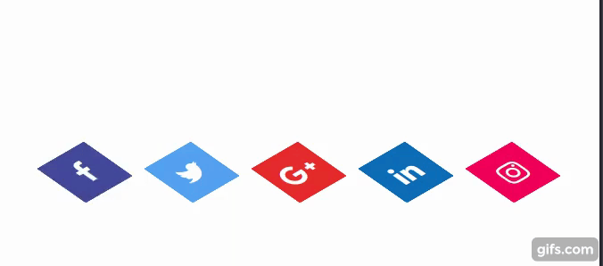
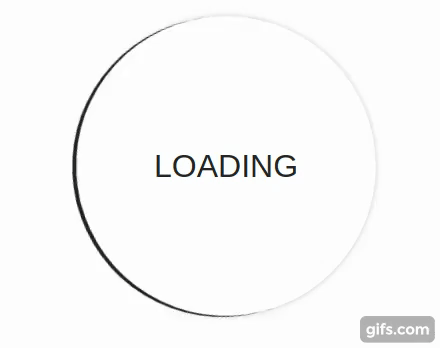
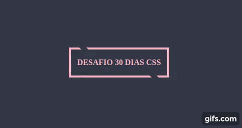
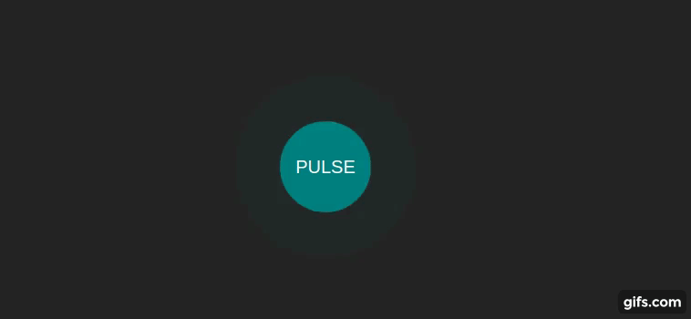
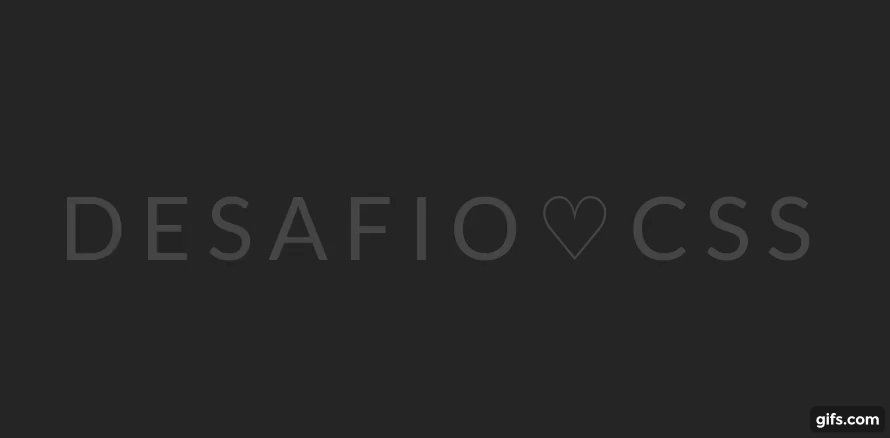

<h1 align="center">
  <strong>🚀 30 days of CSS 🚀</strong>
</h1>

<h3 align="center">
  1 CSS project per day
</h3>

## ✨ Day 1 - Layered social media icon

  

## ✨ Day 2 - Animated loader

  

## ✨ Day 3 - Text color change when entering another div

  

## ✨ Day 4 - Button with effect

  

## ✨ Day 5 - Pulse

  

## ✨ Day 6 - Lightning text effect

  

